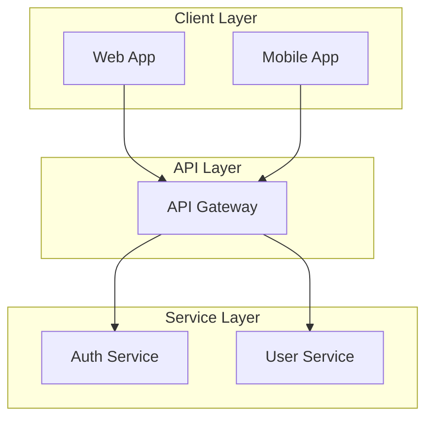
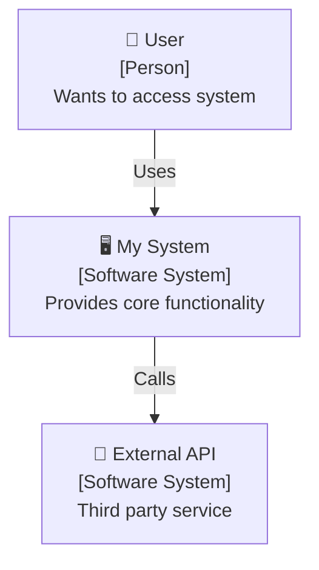
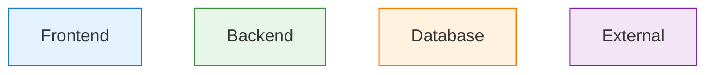

# Architecture Diagrams

Default skill for creating all types of architecture diagrams. Uses Mermaid for GitHub-native diagrams and Beautiful Mermaid for themed high-quality exports.

## When to Use Which Tool

### 🌊 Mermaid Diagrams (Default)
**Use for:**
- Documentation that will be viewed on GitHub/GitLab
- Web-based documentation (MkDocs, Docusaurus)
- Collaboration with non-technical stakeholders
- Complex diagrams with colors and styling

**Output:** Rendered diagrams in Markdown

### 🎨 Beautiful Mermaid (For Themed Exports)
**Use for:**
- High-quality themed diagrams (15+ themes)
- SVG/PNG export for presentations
- Custom color theming
- Dark mode documentation

**Output:** SVG, PNG (high-resolution)

**Themes:** default, dracula, tokyo-night, nord, github-dark, github-light, catppuccin, solarized, one-dark

## Selection Criteria

| Scenario | Recommended Tool |
|----------|------------------|
| GitHub README | Mermaid (native rendering) |
| Documentation site | Mermaid |
| Presentation slides | Beautiful Mermaid (themed PNG) |
| Dark mode docs | Beautiful Mermaid (tokyo-night, dracula) |
| Custom branding | Beautiful Mermaid (custom theme) |
| Terminal/CLI | Mermaid (ASCII not recommended) |

## Quick Start

### Default: Mermaid


### Beautiful Mermaid Alternative
Render themed diagram with custom colors:

```bash
# Using beautiful-mermaid skill
bun run scripts/render.ts \
  --code "graph TD; A[Client] --> B[API]" \
  --output diagram \
  --theme tokyo-night
```

Produces `diagram.svg` with beautiful theming.

## Architecture Diagram Types

### 1. System Context Diagram (C4 Level 1)
Shows the system as a box in the center, surrounded by users and other systems.

**Mermaid:**


### 2. Container Diagram (C4 Level 2)
Shows the high-level technology choices and how responsibilities are distributed.

**Mermaid:**
```mermaid
flowchart TB
    subgraph Browser["Browser"]
        SPA["Single Page Application<br/>[React, TypeScript]"]
    end
    
    subgraph "AWS Region" {
        APIGW["API Gateway<br/>[Nginx]"]
        
        subgraph "ECS Cluster" {
            Auth["Auth Service<br/>[Node.js]"]
            User["User Service<br/>[Node.js]"]
        }
        
        RDS["PostgreSQL<br/>[RDS]"]
        Redis["Redis Cache<br/>[ElastiCache]"]
    }
    
    SPA -->|"HTTPS/JSON"| APIGW
    APIGW --> Auth
    APIGW --> User
    Auth --> RDS
    User --> RDS
    Auth --> Redis
    User --> Redis
```

### 3. Component Diagram (C4 Level 3)
Shows the internal structure of a single container.

### 4. Deployment Diagram
Shows how containers are mapped to infrastructure.

## Best Practices

### Always Include
1. **Clear labels** - Every box should have a name and type
2. **Technology tags** - [React], [PostgreSQL], [AWS Lambda]
3. **Directional arrows** - Show data/request flow
4. **Grouping** - Use subgraphs for logical organization

### Color Coding (Mermaid)


## Decision Tree

```
User wants architecture diagram
        ↓
Target environment?
        ↓
    ┌───┴───┐
   Web      Export
    ↓          ↓
 Mermaid   Beautiful
    ↓       Mermaid
 GitHub     PNG/SVG
  Docs      Slides
```

## References

- **Mermaid**: See `../mermaid-diagrams/SKILL.md` - Native GitHub rendering, quick diagrams
- **Beautiful Mermaid**: See `../beautiful-mermaid/SKILL.md` - Themed exports, 15+ themes, high-quality PNG
