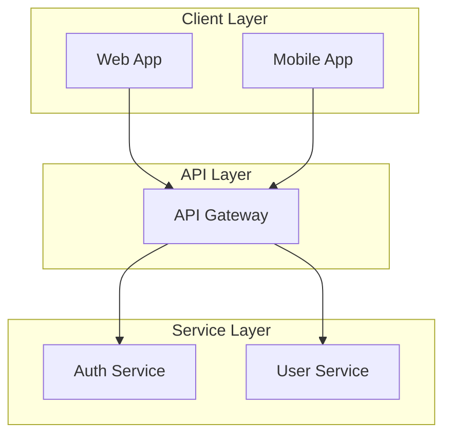
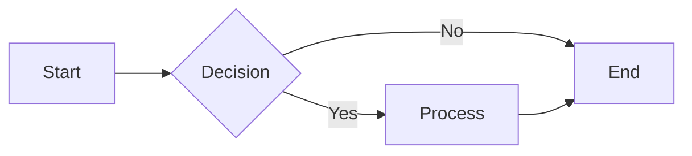
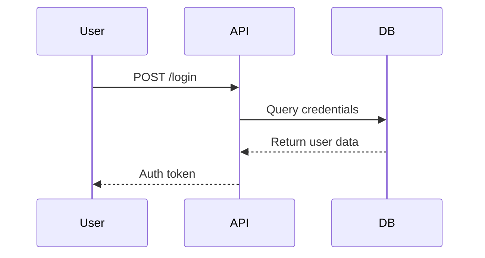
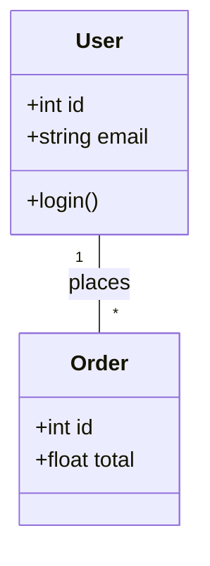
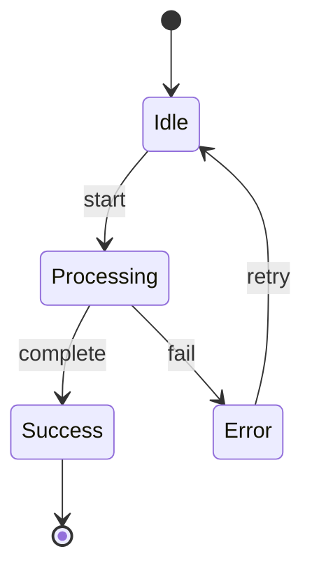
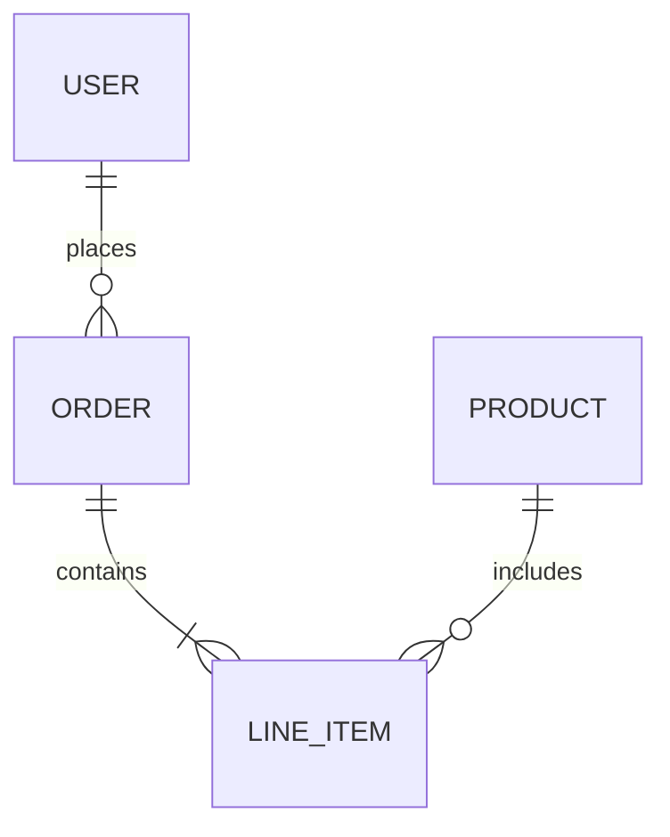
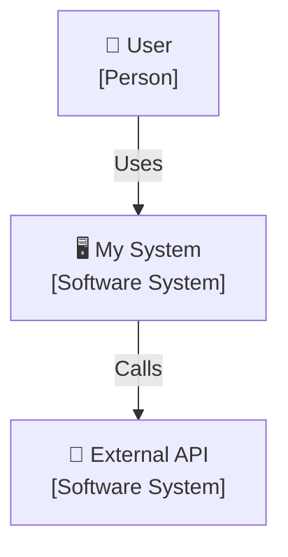
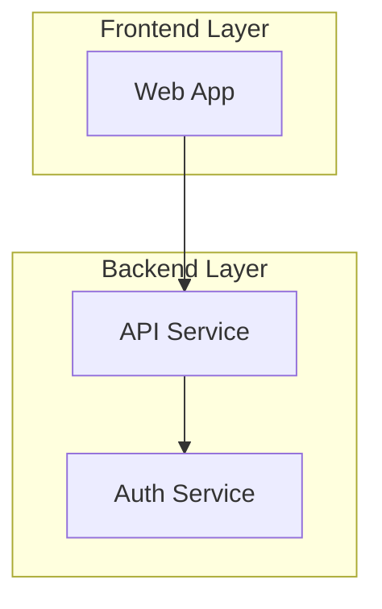
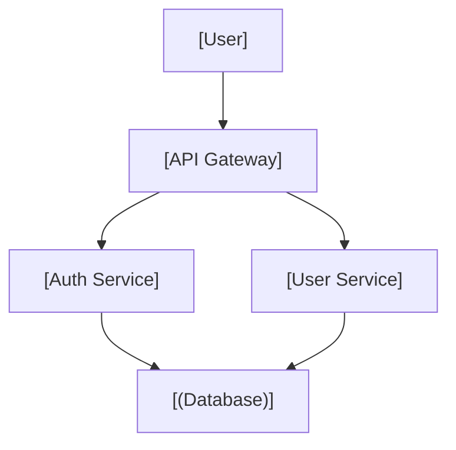

# Architecture Diagrams

Default skill for creating all types of architecture diagrams using **Mermaid**.

## Default: Mermaid

Use Mermaid for all architecture diagrams. It renders natively on GitHub and supports various diagram types.

### Basic Example



## Supported Diagram Types

### 1. Flowchart (流程图)
For processes, workflows, system architecture.



### 2. Sequence Diagram (时序图)
For API interactions, message flows.



### 3. Class Diagram (类图)
For OOP design, entity relationships.



### 4. State Diagram (状态图)
For state machines, lifecycles.



### 5. ER Diagram (实体关系图)
For database schemas.



## Architecture Diagram Types

### C4 Model

#### Level 1: System Context


#### Level 2: Container
```mermaid
flowchart TB
    subgraph Browser["Browser"]
        SPA["SPA<br/>[React]"]
    end
    
    subgraph "AWS" {
        APIGW["API Gateway<br/>[Nginx]"]
        
        subgraph "ECS" {
            Auth["Auth Service<br/>[Node.js]"]
            User["User Service<br/>[Node.js]"]
        }
        
        RDS[(PostgreSQL)]
    }
    
    SPA --> APIGW
    APIGW --> Auth & User
    Auth & User --> RDS
```

## Best Practices

1. **Use clear labels** - Every node should have a name
2. **Add technology tags** - [React], [PostgreSQL], [AWS Lambda]
3. **Show data flow** - Use directional arrows
4. **Group logically** - Use subgraphs for organization
5. **Keep it simple** - Split complex diagrams into multiple views

## Styling

### Default Style (Subgraphs with colors)


### Minimal Style (Clean, ASCII-like layout)
For cleaner look, use simple boxes without heavy styling:



## References

- **Mermaid Syntax**: See `../mermaid-diagrams/SKILL.md`
- **Beautiful Mermaid**: See `../beautiful-mermaid/SKILL.md` - For themed SVG/PNG exports

## Decision Rule

```
Need architecture diagram?
    │
    └── Use Mermaid (always)
        │
        ├── GitHub/Web display → Mermaid code block
        │
        ├── Need themed export → Beautiful Mermaid
        │
        └── Simple diagram → Mermaid minimal style
```

**Always use Mermaid for architecture diagrams.**
