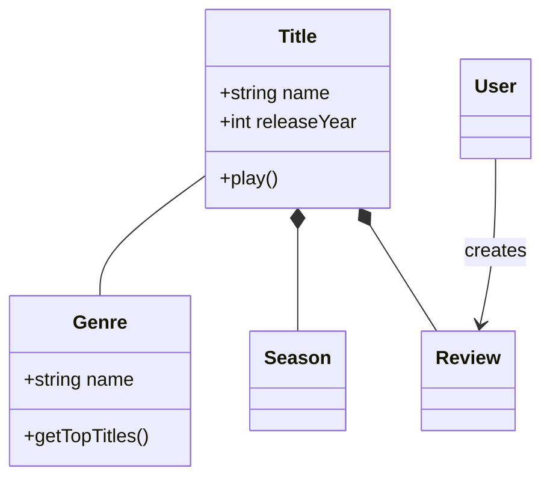
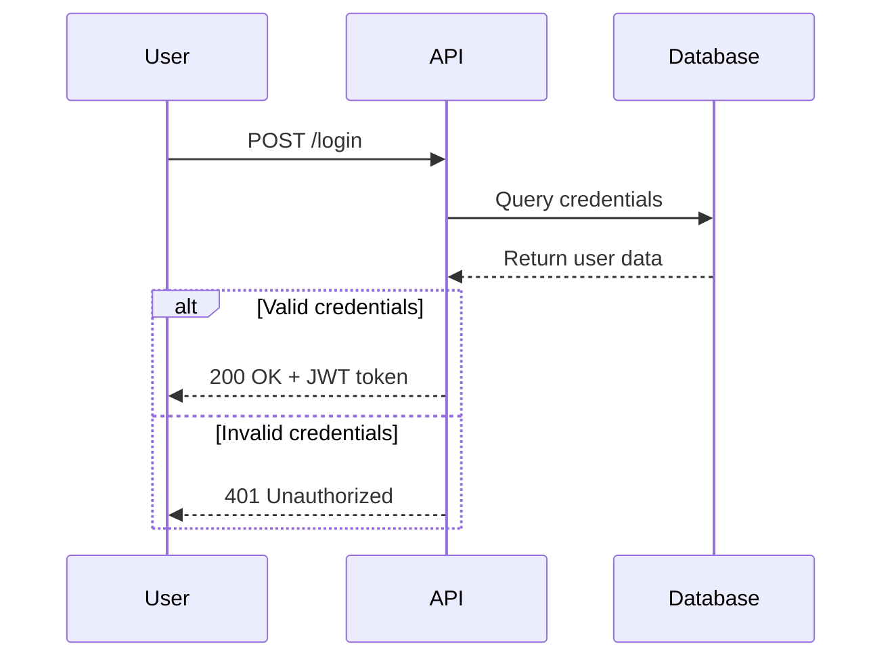
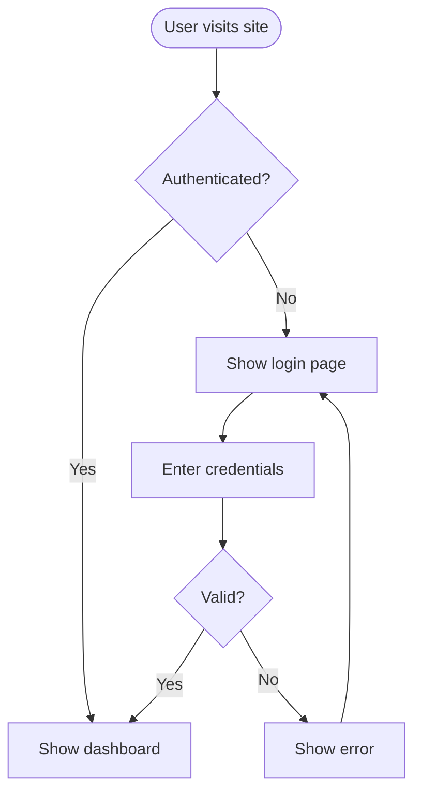
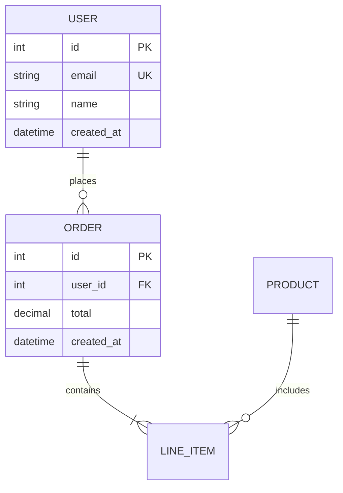
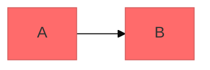
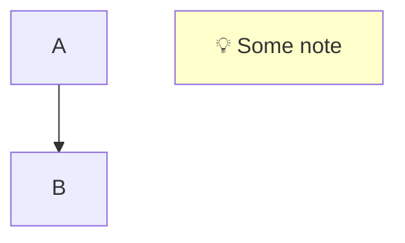
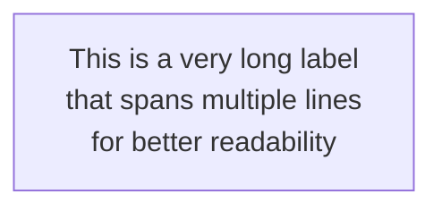
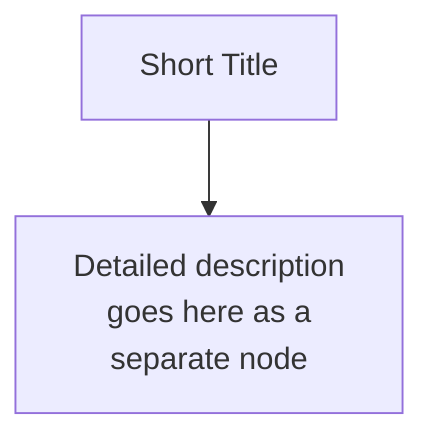
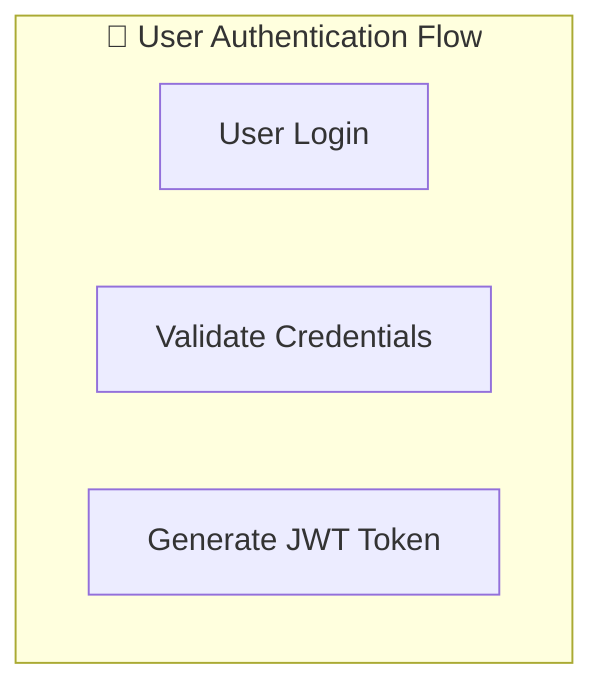
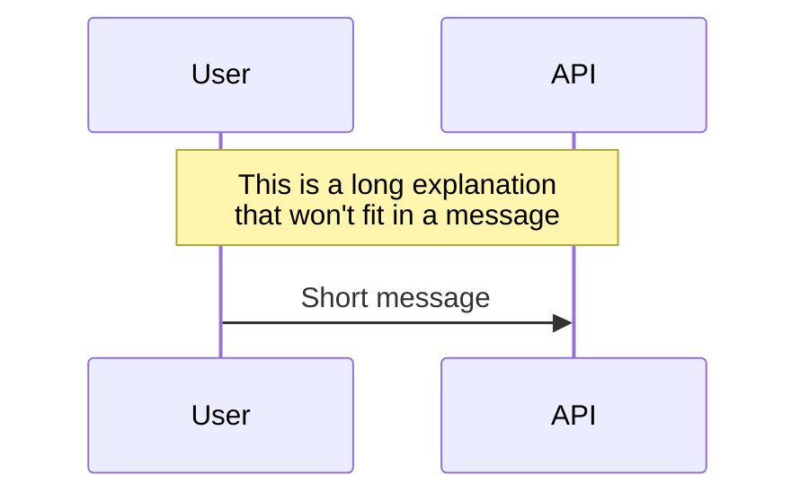

# Mermaid Diagramming

Create professional software diagrams using Mermaid's text-based syntax. Mermaid renders diagrams from simple text definitions, making diagrams version-controllable, easy to update, and maintainable alongside code.

## Core Syntax Structure

All Mermaid diagrams follow this pattern:

```mermaid
diagramType
  definition content
```

**Key principles:**
- First line declares diagram type (e.g., `classDiagram`, `sequenceDiagram`, `flowchart`)
- Use `%%` for comments
- Line breaks and indentation improve readability but aren't required
- Unknown words break diagrams; parameters fail silently

## Diagram Type Selection Guide

**Choose the right diagram type:**

1. **Class Diagrams** - Domain modeling, OOP design, entity relationships
   - Domain-driven design documentation
   - Object-oriented class structures
   - Entity relationships and dependencies

2. **Sequence Diagrams** - Temporal interactions, message flows
   - API request/response flows
   - User authentication flows
   - System component interactions
   - Method call sequences

3. **Flowcharts** - Processes, algorithms, decision trees
   - User journeys and workflows
   - Business processes
   - Algorithm logic
   - Deployment pipelines

4. **Entity Relationship Diagrams (ERD)** - Database schemas
   - Table relationships
   - Data modeling
   - Schema design

5. **C4 Diagrams** - Software architecture at multiple levels
   - System Context (systems and users)
   - Container (applications, databases, services)
   - Component (internal structure)
   - Code (class/interface level)

6. **State Diagrams** - State machines, lifecycle states
7. **Git Graphs** - Version control branching strategies
8. **Gantt Charts** - Project timelines, scheduling
9. **Pie/Bar Charts** - Data visualization

## Quick Start Examples

### Class Diagram (Domain Model)


### Sequence Diagram (API Flow)


### Flowchart (User Journey)


### ERD (Database Schema)


## Detailed References

For in-depth guidance on specific diagram types, see:

- **[references/class-diagrams.md](references/class-diagrams.md)** - Domain modeling, relationships (association, composition, aggregation, inheritance), multiplicity, methods/properties
- **[references/sequence-diagrams.md](references/sequence-diagrams.md)** - Actors, participants, messages (sync/async), activations, loops, alt/opt/par blocks, notes
- **[references/flowcharts.md](references/flowcharts.md)** - Node shapes, connections, decision logic, subgraphs, styling
- **[references/erd-diagrams.md](references/erd-diagrams.md)** - Entities, relationships, cardinality, keys, attributes
- **[references/c4-diagrams.md](references/c4-diagrams.md)** - System context, container, component diagrams, boundaries
- **[references/architecture-diagrams.md](references/architecture-diagrams.md)** - Cloud services, infrastructure, CI/CD deployments
- **[references/advanced-features.md](references/advanced-features.md)** - Themes, styling, configuration, layout options

## Best Practices

1. **Start Simple** - Begin with core entities/components, add details incrementally
2. **Use Meaningful Names** - Clear labels make diagrams self-documenting
3. **Keep Labels Concise** - Use `<br/>` for multi-line text; aim for 20-30 chars per line
4. **Comment Extensively** - Use `%%` comments to explain complex relationships
5. **Keep Focused** - One diagram per concept; split large diagrams into multiple focused views
6. **Version Control** - Store `.mmd` files alongside code for easy updates
7. **Add Context** - Include titles and notes to explain diagram purpose
8. **Iterate** - Refine diagrams as understanding evolves

## Configuration and Theming

Configure diagrams using frontmatter:



**Available themes:** default, forest, dark, neutral, base

**Layout options:**
- `layout: dagre` (default) - Classic balanced layout
- `layout: elk` - Advanced layout for complex diagrams (requires integration)

**Look options:**
- `look: classic` - Traditional Mermaid style
- `look: handDrawn` - Sketch-like appearance

## Exporting and Rendering

**Native support in:**
- GitHub/GitLab - Automatically renders in Markdown
- VS Code - With Markdown Mermaid extension
- Notion, Obsidian, Confluence - Built-in support

**Export options:**
- [Mermaid Live Editor](https://mermaid.live) - Online editor with PNG/SVG export
- Mermaid CLI - `npm install -g @mermaid-js/mermaid-cli` then `mmdc -i input.mmd -o output.png`
- Docker - `docker run --rm -v $(pwd):/data minlag/mermaid-cli -i /data/input.mmd -o /data/output.png`

## Troubleshooting

### Error: `Expecting 'TAGEND', 'STR', ... got 'DIAMOND_START'`

**Symptom:**
```
Parse error on line X:
...ier        Barrier[{"⛔ Barrier<br/>等待全部
----------------------^
Expecting 'TAGEND', 'STR', 'MD_STR', 'UNICODE_TEXT', 'TEXT', 'TAGSTART', got 'DIAMOND_START'
```

**Cause:** Incorrect nesting of node shapes. Diamond nodes `{...}` cannot contain square brackets `[...]` inside.

**Incorrect:**
```mermaid
flowchart TB
    Barrier[{"⛔ Barrier<br/>text"}]  %% ❌ Wrong!
```

**Correct:**
```mermaid
flowchart TB
    Barrier{"⛔ Barrier<br/>text"}   %% ✅ Correct!
```

### Error: `note right of` in flowchart

**Symptom:** `note right of NodeName` causes parse error in flowchart.

**Cause:** `note right of` is only valid in `sequenceDiagram`, not in `flowchart`.

**Incorrect:**
```mermaid
flowchart TB
    A --> B
    note right of B
        Some note
    end note
```

**Correct:**


### Error: `Expecting 'SQE', 'DOUBLECIRCLEEND', ... got 'STR'`

**Symptom:**
```
Parse error on line X:
... Question['❓ "What happens at the ...
-----------------------^
Expecting 'SQE', 'DOUBLECIRCLEEND', 'PE', '-)', 'STADIUMEND', 'SUBROUTINEEND', ...
```

**Cause:** Using single quotes inside square brackets `['...']` is not valid Mermaid syntax. Node labels should use double quotes `["..."]` for text containing special characters.

**Incorrect:**
```mermaid
flowchart TB
    Node['Text with quotes']   %% ❌ Wrong!
    Question['❓ "What happens?"']  %% ❌ Wrong!
```

**Correct:**
```mermaid
flowchart TB
    Node["Text with quotes"]   %% ✅ Correct!
    Question["❓ What happens?"]  %% ✅ Correct!
```

**Key rule:** Always use double quotes `["..."]` for node labels containing:
- Special characters like `"`, `(`, `)`, `<`, `>`
- Emoji and Unicode characters
- HTML tags like `<br/>`

### Issue: Long Labels Truncated or Not Displayed

**Symptom:** Node labels with long text are truncated, overflow, or not fully visible in rendered diagrams.

**Cause:** Mermaid has limited horizontal space for node labels, especially in flowcharts with many nodes.

**Solutions:**

**1. Use Line Breaks (`<br/>`)**


**2. Split into Multiple Nodes**


**3. Use Subgraphs for Organization**


**4. Use Notes or Annotations (Sequence Diagram)**


**Best Practices for Long Labels:**
- Keep node labels under 20-30 characters per line
- Use `<br/>` to break lines at logical points (after commas, before conjunctions)
- Consider using abbreviations for commonly understood terms
- Use subgraph titles to provide context, keeping node labels short
- For very long explanations, link to external documentation using click events

### Node Shape Reference

| Shape | Syntax | Example |
|-------|--------|---------|
| Rectangle | `[text]` | `A["Hello"]` |
| Stadium | `(text)` | `A("Start")` |
| Diamond | `{text}` | `A{"Decision"}` |
| Circle | `((text))` | `A((Circle))` |
| Hexagon | `{{text}}` | `A{{Hexagon}}` |

**Rule:** Diamond nodes `{...}` cannot contain other bracket types inside.

### Issue: Node to Subgraph Arrow Misalignment

**Symptom:** Arrows from nodes to subgraphs appear misaligned, not pointing to the intended location, or seem to "float" without a clear target.

**Root Cause:** When a node and a subgraph are at the same nesting level, Mermaid's layout engine cannot determine which edge of the subgraph to point to (top, bottom, left, or right), resulting in ambiguous arrow placement.

**Problematic Pattern:**
```mermaid
flowchart TB
    subgraph Outer
        NodeA["Node A"]
        subgraph SubB["Subgraph B"]
            Inner["Inner Node"]
        end
        NodeA --> SubB  %% ❌ Ambiguous - points to subgraph boundary
    end
```

**Solution 1: Add a Representative Node (Recommended)**
```mermaid
flowchart TB
    subgraph Outer
        NodeA["Node A"]
        subgraph SubB["Subgraph B"]
            Interface["Interface"]  %% ✅ Representative node
            Inner["Inner Node"]
            Interface --> Inner
        end
        NodeA --> Interface  %% ✅ Clear node-to-node connection
    end
```

**Solution 2: Chain Multiple Subgraphs**
```mermaid
flowchart TB
    subgraph Outer
        subgraph SubA["Subgraph A"]
            Outlet["Outlet Node"]  %% Exit node of SubA
        end
        subgraph SubB["Subgraph B"]
            Inlet["Inlet Node"]    %% Entry node of SubB
        end
        Outlet --> SubB  %% ✅ Works as chain: exit → entry
    end
```

**Solution 3: Restructure with Direction**
```mermaid
flowchart LR
    subgraph Outer
        direction TB
        NodeA["Node A"]
        subgraph SubB["Subgraph B"]
            TopNode["Top Node"]    %% Place at top
            Inner["Inner Node"]
        end
        NodeA --> TopNode  %% ✅ Clear connection to specific position
    end
```

**Best Practices for Subgraph Connections:**
- **Always connect to specific nodes**, not subgraph boundaries
- **Add interface/representative nodes** at subgraph entry/exit points
- **Form chains** when connecting multiple subgraphs (exit → entry)
- **Use explicit directions** (LR/TB) within subgraphs to control layout
- **Avoid** connecting nodes to subgraphs at the same nesting level

## Common Pitfalls

- **Breaking characters** - Avoid `{}` in comments, use proper escape sequences for special characters
- **Syntax errors** - Misspellings break diagrams; validate syntax in Mermaid Live
- **Overcomplexity** - Split complex diagrams into multiple focused views
- **Missing relationships** - Document all important connections between entities
- **Wrong diagram type for elements** - Use `note right of` only in sequenceDiagram, not flowchart

## When to Create Diagrams

**Always diagram when:**
- Starting new projects or features
- Documenting complex systems
- Explaining architecture decisions
- Designing database schemas
- Planning refactoring efforts
- Onboarding new team members

**Use diagrams to:**
- Align stakeholders on technical decisions
- Document domain models collaboratively
- Visualize data flows and system interactions
- Plan before coding
- Create living documentation that evolves with code
